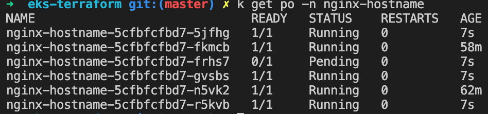
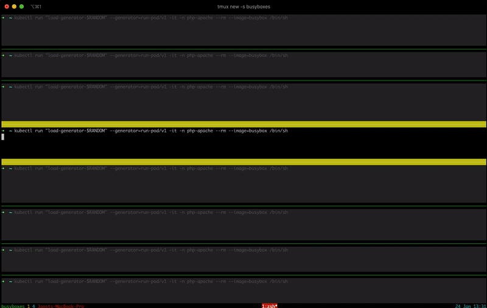
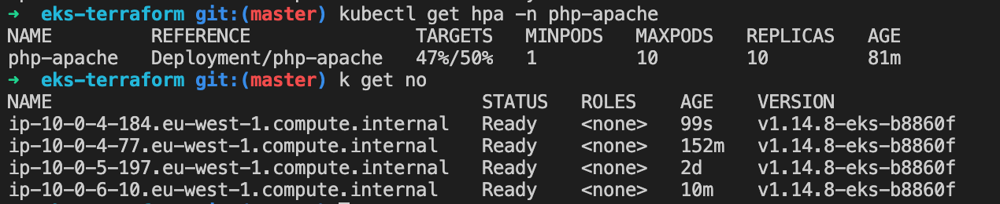

# eks-terraform

Terraform deployment, Cluster Autoscaler(CA) and Horizontal Pod Autoscaler(HPA) on EKS.

This README describes how to:

1. deploy an EKS with Terraform;
2. deploy [Cluster Autoscaler](https://github.com/kubernetes/autoscaler/tree/master/cluster-autoscaler) to the cluster;
3. demontrate EKS autoscaling with a simple deployment
4. deploy and demonstrate Horizontal Pod Autoscaling

## 1\. Infrastructure as Code: declarative deployment of EKS

Automated deployment is done with Hashicorps' [Terraform](https://www.terraform.io/); as an alternative, I could have opted for CloudFormation which covers almost all bits and pieces of AWS. BUT Terraform covers the most important AWS resources, including EKS with autoscaling. On top of that, Terraform can provision infrastructure at OTHER cloud providers and as such prevents a vendor lock-in.

What you need in advance to run this deployment:

- Terraform CLI version 0.12.19 installed locally;
- [Kubectl](https://kubernetes.io/docs/tasks/tools/install-kubectl/) installed locally;
- the [AWS CLI](https://docs.aws.amazon.com/cli/latest/userguide/cli-chap-configure.html) installed and configured with credentials.

The templates can be found in the `terraform` directory, using the [Terraform-AWS-EKS module](https://github.com/terraform-aws-modules/terraform-aws-eks). Initialize modules, plugins, etc and plan the deployment:

```cmd
cd terraform
terrafrom init
terraform plan
```

Deploy the config with:

```cmd
terraform apply
```

This takes about 20 minutes, which is slow compared to GKE (3 minutes) and AKS (~10 minutes).

Configure kubectl:

```cmd
mv kubeconfig_dobdata-eks-demo-cluster ~/.kube/config-aws
export KUBECONFIG=$KUBECONFIG:~/.kube/config-aws
kubectl config use-context aws-dobdata-eks-demo-cluster
```

Verify the deployment:

```cmd
$ kubectl get nodes
NAME                                       STATUS   ROLES    AGE   VERSION
ip-10-0-4-175.eu-west-1.compute.internal   Ready    <none>   58s   v1.14.8-eks-b8860f
ip-10-0-5-197.eu-west-1.compute.internal   Ready    <none>   57s   v1.14.8-eks-b8860f
```

Now that we have a working Kubernetes cluster, we'll implement autoscaling.

## 2\. Setup autoscaling

The cluster autoscaler adjusts the number of worker nodes when there are insufficient resources to place a pod, or when the cluster is underutilized for an specified period of time.

To [enabling autoscaling](https://github.com/terraform-aws-modules/terraform-aws-eks/blob/master/docs/autoscaling.md) configure and apply the following settings to the `worker_groups` in the `eks` module in the `terraform/main.tf` file:

```yml
worker_groups = [{
      ...
    asg_min_size        = 1
    asg_max_size        = 5
    autoscaling_enabled = true
    protect_from_scale_in = true
}]
```

We also need to install the [cluster-autoscaler](https://github.com/kubernetes/autoscaler/tree/master/cluster-autoscaler) into the cluster. The easiest way is to deploy [the available Helm chart](https://github.com/helm/charts/tree/master/stable/cluster-autoscaler). But when initialized, the server side of Helm, Tiller, runs in your cluster with full admin rights, which is undeniable a security issue. I have worked some time with [the method of Tobias Bradtke](https://blog.giantswarm.io/what-you-yaml-is-what-you-get/); use Helm locally to render the templates as manifests to deploy. Keep all charts and rendered files in a git repository has the additional advantage of tracking changes to the cluster. For these operations I generally use three bash files.

Fetch the charts and the default values file:

````cmd
$ ./cluster-autoscaler/fetch.sh
FETCH CHARTS
```

Render the charts to manifests with custom values. Note that the value file contains:

```cmd
$ ./cluster-autoscaler/render.sh
RENDER MANIFESTS
wrote /Users/joostdobken/eks-terraform/cluster-autoscaler/manifests/cluster-autoscaler/templates/pdb.yaml
wrote /Users/joostdobken/eks-terraform/cluster-autoscaler/manifests/cluster-autoscaler/templates/serviceaccount.yaml
wrote /Users/joostdobken/eks-terraform/cluster-autoscaler/manifests/cluster-autoscaler/templates/clusterrole.yaml
wrote /Users/joostdobken/eks-terraform/cluster-autoscaler/manifests/cluster-autoscaler/templates/clusterrolebinding.yaml
wrote /Users/joostdobken/eks-terraform/cluster-autoscaler/manifests/cluster-autoscaler/templates/role.yaml
wrote /Users/joostdobken/eks-terraform/cluster-autoscaler/manifests/cluster-autoscaler/templates/rolebinding.yaml
wrote /Users/joostdobken/eks-terraform/cluster-autoscaler/manifests/cluster-autoscaler/templates/service.yaml
wrote /Users/joostdobken/eks-terraform/cluster-autoscaler/manifests/cluster-autoscaler/templates/deployment.yaml
```

Deploy the manifests to the cluster:

```cmd
$ ./cluster-autoscaler/deploy.sh
DEPLOY MANIFESTS
clusterrole.rbac.authorization.k8s.io/cluster-autoscaler-aws-cluster-autoscaler created
clusterrolebinding.rbac.authorization.k8s.io/cluster-autoscaler-aws-cluster-autoscaler created
deployment.apps/cluster-autoscaler-aws-cluster-autoscaler created
poddisruptionbudget.policy/cluster-autoscaler-aws-cluster-autoscaler created
role.rbac.authorization.k8s.io/cluster-autoscaler-aws-cluster-autoscaler created
rolebinding.rbac.authorization.k8s.io/cluster-autoscaler-aws-cluster-autoscaler created
service/cluster-autoscaler-aws-cluster-autoscaler created
serviceaccount/cluster-autoscaler-aws-cluster-autoscaler created
````

## 3\. Auto-Scaling in practice

Deploy an example application, e.g. [nginx-hostname](https://hub.docker.com/r/stenote/nginx-hostname/tags) returns the name of the host container.

```cmd
$ kubectl apply -f nginx-hostname/nginx-hostname-deployment.yaml
namespace/nginx-hostname created
deployment.apps/nginx-hostname created
```

Wait untill the pod has started and forward the port:

```cmd
kubectl port-forward -n nginx-hostname $(kubectl get pod -n nginx-hostname -o jsonpath="{.items[0].metadata.name}") 8080:80
```

In another shell, get the name of the host running the pod:

```cmd
$ curl localhost:8080
nginx-hostname-798c6f6564-7bsd8 | v1.0
```

That is not really spectacular, but this brings us to the point where we can demonstrate how auto-scaling works. The deployment of the nginx-hostname includes requested resources:

```yml
...
    resources:
      requests:
        memory: "4GiB"
        cpu: "1050m"
```

That is definitely an overkill of resources for such a simple pod; but since the m4.large instances only have 2 CPU and 8 GiB Memory, two of these pods will never be deployed on 1 machine.

### Upscaling

The simplest way to increase the number of replicas is to set the number of replicas to 3 in the file `nginx-hostname/nginx-hostname-deployment.yaml` and run `kubectl apply -f nginx-hostname/nginx-hostname-deployment.yaml`.

```cmd
$ kubectl get po -n nginx-hostname -o wide -w
NAME                              READY   STATUS    RESTARTS   AGE     IP          NODE                                       NOMINATED NODE   READINESS GATES
nginx-hostname-5cfbfcfbd7-fkmcb   1/1     Running   0          39s     10.0.4.16   ip-10-0-4-175.eu-west-1.compute.internal   <none>           <none>
nginx-hostname-5cfbfcfbd7-n5vk2   1/1     Running   0          4m57s   10.0.5.28   ip-10-0-5-197.eu-west-1.compute.internal   <none>           <none>
nginx-hostname-5cfbfcfbd7-t896q   0/1     Pending   0          6s      <none>      <none>                                     <none>           <none>
```

Currently the third pod cannot be placed on any machine. If you wait one minute (or two), if auto-scaling is correctly configured, the last pod will change status to "Running". When we check the number of nodes:

```cmd
$ kubectl get no
NAME                                       STATUS   ROLES    AGE    VERSION
ip-10-0-4-175.eu-west-1.compute.internal   Ready    <none>   147m   v1.14.8-eks-b8860f
ip-10-0-5-197.eu-west-1.compute.internal   Ready    <none>   159m   v1.14.8-eks-b8860f
ip-10-0-6-188.eu-west-1.compute.internal   Ready    <none>   5m4s   v1.14.8-eks-b8860f
```

There are three instances! I experienced that the up-scaling latency is really only 30 to 60 seconds. Increase the number of replicas to 6 and apply it to the cluster. When after one or two minutes, we check the number of pods:



There is still one pending pod. This is expected behavior, because we have indicated in the file `terraform/main.tf` that the worker group can scale up to a maximum of 5 instances (variable `asg_max_size`).

If one or more intances of the worker group dies, autoscaler will also request to spin up a new instance. This can be demonstrated by simply terminating one instance via [the console](https://eu-west-1.console.aws.amazon.com/ec2/v2/home?region=eu-west-1#Instances:sort=instanceId).

### Downscaling

Change the number of replicas back to 2\. We expect the following behavior:

- first the number of nginx-hostname pods will be reduced to two;
- autoscaling detects that the load on the cluster is reduced and shuffling of pods is possible;
- three of the five instances are terminated.

The latency to scale down is is about 10 minutes, much longer than for upscaling. Some cooldown period for scalingdown is certainly desired to deal with volatility in demand. But one can tune this settings in the `cluster-autoscaler/values/cluster-autoscaler.yaml` file.

Clean up the pods and the namespace:

```cmd
$ kubectl delete -f ./nginx-hostname/nginx-hostname-deployment.yaml
namespace "nginx-hostname" deleted
deployment.apps "nginx-hostname" deleted
```

## 4\. Horizontal Pod Autoscaler

In addition to cluster-autoscaling, we can use [Horizontal Pod Autoscaling](https://kubernetes.io/docs/tasks/run-application/horizontal-pod-autoscale-walkthrough/); scale the number of pod replicas based on observed CPU utilization and memory usage.

### metrics-server monitoring

We need to deploy metric-server monitoring to the cluster; to monitor the resource usage of pods.

> I had an issue with the standard deployment, where the resources could not be read correctly; the documentation of metrics-server does not describe the following step, but I found a description from [Mr. Turtle on SO](https://stackoverflow.com/a/54106726/5316326).

Delete any previous instance of metrics-server from your Kubernetes instance with:

```
kubectl delete -n kube-system deployments.apps metrics-server
```

Again, we will deploy the [helm chart](https://github.com/helm/charts/tree/master/stable/metrics-server) with the same method as we deployed cluster-autoscaler (the Tobias Bradtke method?):

```cmd
$./metrics-server/deploy.sh
DEPLOY MANIFESTS
clusterrole.rbac.authorization.k8s.io/system:metrics-server-aggregated-reader created
clusterrolebinding.rbac.authorization.k8s.io/metrics-server:system:auth-delegator created
clusterrole.rbac.authorization.k8s.io/system:metrics-server created
service/metrics-server created
apiservice.apiregistration.k8s.io/v1beta1.metrics.k8s.io created
clusterrolebinding.rbac.authorization.k8s.io/system:metrics-server created
deployment.apps/metrics-server created
serviceaccount/metrics-server created
rolebinding.rbac.authorization.k8s.io/metrics-server-auth-reader created
pod/metrics-server-test created
```

### Pod and hpa deployment

To demonstrate Horizontal Pod Autoscaler we need a pod that intensively consumes resources. For convenience I use [the example image of Kubernetes](https://kubernetes.io/docs/tasks/run-application/horizontal-pod-autoscale-walkthrough/), I would have liked to come up with something more original, but this way I can at least demonstrate the behavior.

The image **k8s.gcr.io/hpa-example** performs some CPU intensive computation. The deployment has a requests of 500 millicores and a limit of 500 millicores; this means that the kube-scheduler will place a pod on a node only if the requested millicores are available on that node, just like in the earlier example. A little pragmatic math follows: 2000/500 = 3 of these pods fit on one instance, so we expect, when fully utilized, 10 pods will be deployed on... 10/3 = 4 instances!

Deploy the pod and service:

```cmd
$ kubectl apply -f ./php-apache/php-apache-deployment.yaml
namespace/php-apache created
deployment.apps/php-apache created
service/php-apache created
```

Check the status of the deployment of a single pod:

```cmd
$k get po -n php-apache
NAME                          READY   STATUS    RESTARTS   AGE
php-apache-7889465795-mz6g6   1/1     Running   0          4m48s
```

Deploy the HPA:

```cmd
$kubectl apply -f ./php-apache/php-apache-hpa.yaml
horizontalpodautoscaler.autoscaling/php-apache created
```

We may check the current status of autoscaler by running:

```cmd
$kubectl get hpa -n php-apache
NAME         REFERENCE               TARGETS   MINPODS   MAXPODS   REPLICAS   AGE
php-apache   Deployment/php-apache   0%/50%    1         10        1          4m
```

to show that hpa and ca complement each other, verify that there are currently only two instances running:

```cmd
$k get no
NAME                                       STATUS   ROLES    AGE   VERSION
ip-10-0-4-77.eu-west-1.compute.internal    Ready    <none>   36m   v1.14.8-eks-b8860f
ip-10-0-5-197.eu-west-1.compute.internal   Ready    <none>   46h   v1.14.8-eks-b8860f
```

### HPA in practice

Let's see how the horizontal pod autoscaler reacts to increasing load:

```cmd
$kubectl run --generator=run-pod/v1 -it -n php-apache --rm load-generator --image=busybox /bin/sh
```

In bash, run the following command to send an infinite loop of queries to the php-apache service:

```cmd
while true; do wget -q -O- http://php-apache.php-apache.svc.cluster.local; done
```

In another terminal, you can check the CPU usage and number of replicas:

```cmd
$k get hpa -n php-apache
NAME         REFERENCE               TARGETS    MINPODS   MAXPODS   REPLICAS   AGE
php-apache   Deployment/php-apache   100%/50%   1         10        2          17m
```

The CPU consumption has increased to 100% of the request. It may take a few minutes before more pods are deployed.

### [Burn baby burn](https://github.com/chrislgarry/Apollo-11/blob/master/Luminary099/BURN_BABY_BURN--MASTER_IGNITION_ROUTINE.agc)

As a micro bonus I will launch many busyboxes as above to further increase the load and see if we can actually get number of deployed pods to the maximum of 10 and 4 instances running. [tmux](https://github.com/tmux/tmux/wiki) can be used to run commands on multiple compute instances at the same time.

In the terminal, start a new tmux session

```cmd
tmux new -s busyboxes
```

Create a couple of new panes with ctrl+B + `"`. Turn on synchronize-panes: ctrl+B + `:` and type `setw synchronize-panes on`:

Now type run as many busyboxes:

```cmd
kubectl run "load-generator-$RANDOM" --generator=run-pod/v1 -it -n php-apache --rm --image=busybox /bin/sh
```

In bash, run the following command to send an infinite loop of queries to the php-apache service:

```cmd
while true; do wget -q -O- http://php-apache.php-apache.svc.cluster.local; done
```



It took some time, but eventually I got 10 pods and four instances running!



## Resources

- [Terraform AWS templates for EKS](https://github.com/terraform-aws-modules/terraform-aws-eks)
- [Article explains HPA](https://medium.com/magalix/kubernetes-autoscaling-101-cluster-autoscaler-horizontal-pod-autoscaler-and-vertical-pod-2a441d9ad231)
- [Horizontal Pod Autoscaling](https://kubernetes.io/docs/tasks/run-application/horizontal-pod-autoscale-walkthrough/)
